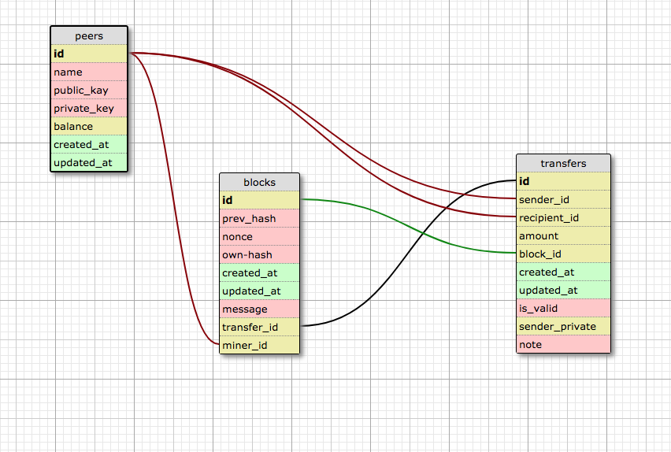

# Epicoin
Epicodus Ruby Group Project

## March 8, 2018

#### By Andrew Peterson, John Rykken, Misha Petrov, David Lewis & Jared Clemmensen

## Technologies Used
  * Ruby, Javascript, sass, ActiveRecord, Sinatra, PostgreSQL  

## Description
  An emulation of a blockchain node for a brand new cryptocurrency called Epicoin.

## Specs

#### Backend
##### Database


##### Custom ruby classes      
  3.
    *
  4.
    *


#### Frontend
##### User stories
  1.
  2.
  3.
  4.


## Known bugs


## Setup/Installation Requirements

  Clone to your Desktop.
  In terminal, navigate to the root directory of the project.
  Recreate the database by using the following commands in terminal:

  ```
  $ bundle
  ```
  ```
  $ rake db:create
  ```
  ```
  $ rake db:migrate
  ```

  Use this command in terminal to run app on the localhost:

  ```
  $ ruby epicoin.rb
  ```

  Open your browser and go to localhost:4567

## Technologies Used
  This application was written in Ruby, built with Sinatra and uses Postgresql for database management.

## License
  Copyright (c) 2018 Jared Clemmensen, Andrew Peterson, John Rykken, Misha Petrov & David Lewis

  Permission is hereby granted, free of charge, to any person obtaining a copy of this software and associated documentation files (the "Software"), to deal in the Software without restriction, including without limitation the rights to use, copy, modify, merge, publish, distribute, sublicense, and/or sell copies of the Software, and to permit persons to whom the Software is furnished to do so, subject to the following conditions:

  The above copyright notice and this permission notice shall be included in all copies or substantial portions of the Software.

  THE SOFTWARE IS PROVIDED "AS IS", WITHOUT WARRANTY OF ANY KIND, EXPRESS OR IMPLIED, INCLUDING BUT NOT LIMITED TO THE WARRANTIES OF MERCHANTABILITY, FITNESS FOR A PARTICULAR PURPOSE AND NONINFRINGEMENT. IN NO EVENT SHALL THE AUTHORS OR COPYRIGHT HOLDERS BE LIABLE FOR ANY CLAIM, DAMAGES OR OTHER LIABILITY, WHETHER IN AN ACTION OF CONTRACT, TORT OR OTHERWISE, ARISING FROM, OUT OF OR IN CONNECTION WITH THE SOFTWARE OR THE USE OR OTHER DEALINGS IN THE SOFTWARE.
